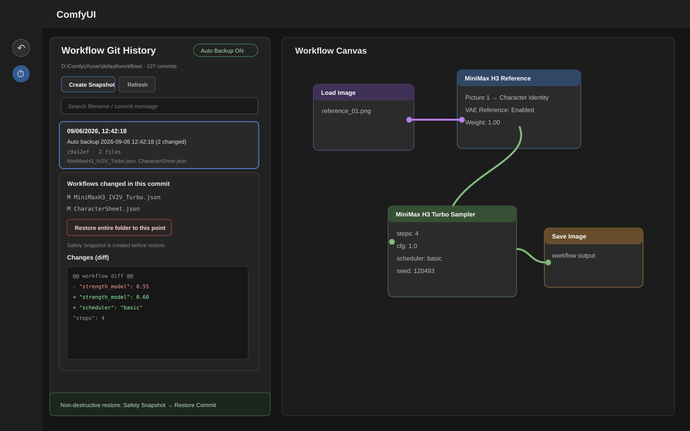

# Comfyui-Restore-Workflows

> Automatic local Git versioning, history inspection, and safe full-folder restore for ComfyUI workflows.

`Comfyui-Restore-Workflows` protects `ComfyUI/user/default/workflows` with a local Git repository and adds a **Workflow Git** sidebar panel to ComfyUI.

It is designed for the annoying cases where a workflow gets overwritten by another workflow, saved in the wrong state, accidentally deleted, or otherwise corrupted.



> The image above is a UI preview that mirrors the current sidebar implementation. Exact appearance may vary slightly depending on your ComfyUI theme/frontend version.

---

## English

### Features

- Automatically initializes Git inside `user/default/workflows`
- Creates an initial snapshot on first launch
- Watches workflow files while ComfyUI is running
- Automatically commits after roughly **6 seconds** with no further changes
- Adds a **Workflow Git** tab to the ComfyUI sidebar
- Shows commit date/time, commit message, changed files, and commit hash
- Displays a unified Git diff for the selected commit
- Click a changed file to inspect its JSON at that exact commit
- Search by workflow filename or commit message
- Manually create a snapshot at any time
- Restore the **entire workflows folder** to a selected commit
- Automatically creates a **Safety Snapshot** immediately before restore
- Restore itself is recorded as a new commit, so later states remain recoverable
- No GitHub push and no cloud sync
- All history stays local inside `workflows/.git`

### Installation

Requirements:

- **Git for Windows**
- `git` must be available from your system `PATH`

Clone the repository into ComfyUI's `custom_nodes` directory:

```powershell
cd "D:\ComfyUI-Easy-Install\ComfyUI-Easy-Install\ComfyUI\custom_nodes"
git clone https://github.com/ssain3d-lgtm/Comfyui-Restore-Workflows.git
```

Or install manually at:

```text
ComfyUI/
└─ custom_nodes/
   └─ Comfyui-Restore-Workflows/
      ├─ __init__.py
      ├─ workflow_git.py
      └─ web/
         └─ js/
            └─ workflow_git.js
```

Restart ComfyUI after installation.

### Verify installation

You should see console messages similar to:

```text
[Restore Workflows] git init: ...\user\default\workflows
[Restore Workflows] initial snapshot created
[Restore Workflows] watching ...\user\default\workflows (auto commit after 6s idle)
```

A local Git repository will also be created at:

```text
ComfyUI\user\default\workflows\.git
```

### Usage

1. Open **Workflow Git** from the ComfyUI sidebar.
2. Browse commits by modification time.
3. Select a commit.
4. Review the changed workflow files and Git diff.
5. Click a workflow file to inspect its exact JSON at that point in history.
6. Click **Restore entire folder to this point** when you find the desired snapshot.
7. Reopen any already-open workflow in ComfyUI to load the restored file from disk.

### Automatic backup flow

```text
Workflow saved / modified
        ↓
File change detected
        ↓
~6 seconds with no further changes
        ↓
git add -A
        ↓
Automatic Git commit
```

No commit is created when nothing changed.

### Safe restore model

Restore is intentionally non-destructive to Git history.

```text
Current workflows state
        ↓
Create Safety Snapshot if needed
        ↓
Restore the selected historical tree
        ↓
Create a new Restore commit
```

For example:

```text
A → B → C → D
```

Restoring state `C` creates a new state conceptually like:

```text
A → B → C → D → Restore-to-C
```

State `D` is still present in history and can be recovered later.

### Important notes

- This extension cannot recover versions that were already lost before the extension was installed and before Git history existed.
- Git can only version workflow files that were actually saved to disk. Unsaved canvas edits are not part of Git history.
- The default monitored path is `user/default/workflows`.
- Very large diffs/file previews may be truncated in the sidebar at around 1 MB for responsiveness. The actual files stored in Git are not truncated.
- Restoring files on disk does not forcibly replace a workflow that is already open on the canvas. Reopen that workflow after restore.

---

## 한국어

### 소개

`Comfyui-Restore-Workflows`는 ComfyUI의 `user/default/workflows` 폴더를 **로컬 Git으로 자동 버전 관리**하고, ComfyUI 사이드바에서 과거 Workflow 상태를 직접 확인하고 복구할 수 있게 해주는 커스텀 노드입니다.

다른 Workflow가 기존 Workflow를 덮어써버리거나, 잘못된 상태로 저장되거나, 파일이 삭제/손상된 경우를 대비하는 용도입니다.

> 실제 ComfyUI UI는 영어로 제공됩니다. README는 영어/한국어를 함께 제공합니다.

### 주요 기능

- ComfyUI 시작 시 `user/default/workflows`를 자동 Git 저장소로 초기화
- 최초 실행 시 현재 Workflow 전체를 초기 Snapshot으로 저장
- ComfyUI 실행 중 Workflow 파일 변경 감지
- 마지막 변경 후 약 **6초** 동안 추가 변경이 없으면 자동 Commit
- ComfyUI 왼쪽 사이드바에 **Workflow Git** 탭 추가
- Commit 날짜/시간, Commit 메시지, 변경 파일, Commit hash 표시
- 선택한 Commit의 실제 Git diff 표시
- 변경 파일 클릭 시 해당 Commit 당시의 실제 JSON 내용 확인
- Workflow 파일명 / Commit 메시지 검색
- 필요할 때 수동 Snapshot 생성
- 원하는 Commit을 선택해 **workflows 폴더 전체를 해당 시점으로 복구**
- 복구 직전 현재 디스크 상태를 **Safety Snapshot**으로 자동 저장
- 복구 자체도 새로운 Commit으로 기록
- 따라서 복구를 잘못해도 이후 상태가 Git 이력에 그대로 남아 다시 돌아갈 수 있음
- GitHub Push / Cloud Sync 없음
- 모든 Git 이력은 `workflows/.git`에 로컬로 저장

### 설치

필수 조건:

- **Git for Windows**
- Windows `PATH`에서 `git` 명령을 실행할 수 있어야 함

ComfyUI의 `custom_nodes` 폴더에서:

```powershell
cd "D:\ComfyUI-Easy-Install\ComfyUI-Easy-Install\ComfyUI\custom_nodes"
git clone https://github.com/ssain3d-lgtm/Comfyui-Restore-Workflows.git
```

수동으로 설치할 경우:

```text
ComfyUI/
└─ custom_nodes/
   └─ Comfyui-Restore-Workflows/
      ├─ __init__.py
      ├─ workflow_git.py
      └─ web/
         └─ js/
            └─ workflow_git.js
```

설치 후 ComfyUI를 재시작합니다.

### 정상 동작 확인

ComfyUI 콘솔에 다음과 비슷한 메시지가 표시됩니다.

```text
[Restore Workflows] git init: ...\user\default\workflows
[Restore Workflows] initial snapshot created
[Restore Workflows] watching ...\user\default\workflows (auto commit after 6s idle)
```

그리고 아래 위치에 로컬 Git 저장소가 생성됩니다.

```text
ComfyUI\user\default\workflows\.git
```

### 사용 방법

1. ComfyUI 왼쪽 사이드바에서 **Workflow Git**을 엽니다.
2. 수정 날짜/시간을 보고 원하는 Commit을 찾습니다.
3. Commit을 선택합니다.
4. 변경된 Workflow 파일과 Git diff를 확인합니다.
5. 파일명을 클릭하면 해당 Commit 당시의 실제 JSON을 볼 수 있습니다.
6. 복구할 시점을 찾았다면 **Restore entire folder to this point**를 누릅니다.
7. 복구 후 이미 열려 있던 Workflow는 다시 열어 디스크의 복구본을 불러옵니다.

### 자동 백업 방식

```text
Workflow 저장 / 수정
        ↓
파일 변경 감지
        ↓
약 6초 동안 추가 변경 없음
        ↓
git add -A
        ↓
자동 Git Commit
```

변경된 파일이 없으면 Commit을 만들지 않습니다.

### 안전 복구 방식

복구할 때 과거 Commit으로 `git reset --hard`하여 이후 이력을 잘라내지 않습니다.

```text
현재 workflows 상태
        ↓
필요하면 Safety Snapshot 생성
        ↓
선택한 과거 Commit의 전체 Tree 복원
        ↓
새 Restore Commit 생성
```

예를 들어 현재 이력이:

```text
A → B → C → D
```

일 때 `C`로 복구하면 개념적으로:

```text
A → B → C → D → Restore-to-C
```

형태가 됩니다.

따라서 기존 `D` 상태도 Git 이력에 그대로 남아 나중에 다시 복구할 수 있습니다.

### 주의사항

- 이 커스텀 노드를 설치하기 전에 이미 사라진 Workflow 버전은 복구할 수 없습니다.
- Git은 **실제 디스크에 저장된 Workflow 파일**만 추적합니다. 캔버스에서 수정만 하고 저장하지 않은 내용은 Git 이력에 없습니다.
- 기본 감시 대상은 `user/default/workflows`입니다.
- 매우 큰 Workflow는 UI 반응성을 위해 diff/파일 미리보기가 약 1 MB에서 잘릴 수 있습니다. Git에 저장되는 실제 원본 파일은 잘리지 않습니다.
- 복구 직후 이미 열려 있는 Canvas가 자동으로 과거 상태로 교체되는 것은 아닙니다. 해당 Workflow를 다시 열어야 복구된 파일이 표시됩니다.

---

## License

MIT
